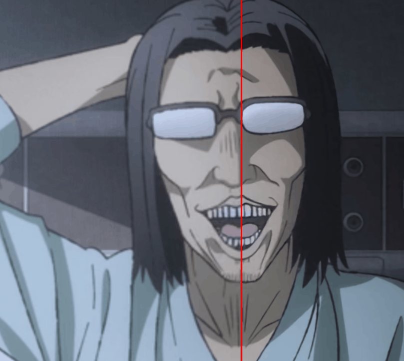
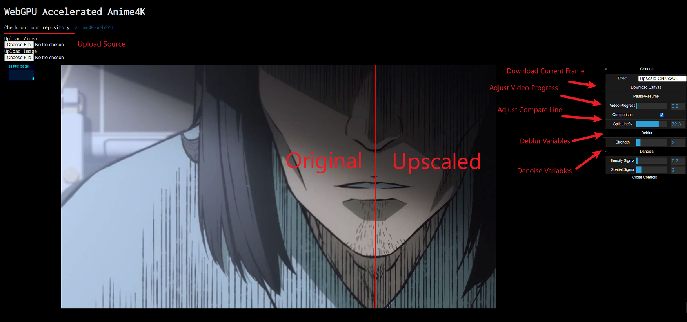
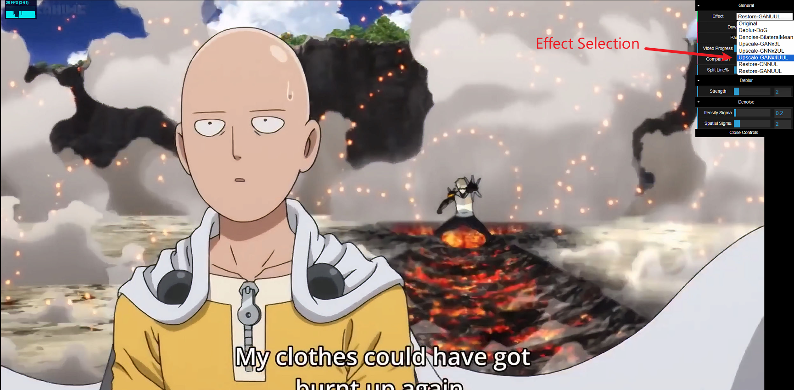

# WebGPU Accelerated Anime 4K

Authors (alphabetical order with equal contribution):
* Ruijun(Daniel) Zhong [LinkedIn](https://www.linkedin.com/in/daniel-z-73158b152/) | [Personal Website](https://www.danielzhongportfolio.com/)
* Tong Hu  [LinkedIn](https://www.linkedin.com/in/tong-hu-5819a122a/) 
* Yuanqi Wang [LinkedIn](https://www.linkedin.com/in/yuanqi-wang-414b26106/) | [GitHub](https://github.com/plasmas)

## Description
WebGPU Accelerated Anime 4K harnesses WebGPU and GPU compute shaders to rapidly enhance anime-style graphics. Leveraging the power of modern GPUs, it executes complex deblurring, CNN-based upscaling, and denoising algorithms in real-time. As a result, each video frame is processed instantaneously, improving clarity, sharpness, and eliminating noise as it streams. This ensures a superior viewing experience with high-quality visuals delivered without interruption, ideal for anime fans and professionals seeking top-notch and efficient image fidelity.

## Demo
[Demo Link](https://anime4k-webgpu-demo.fly.dev/)  

Explore the [Anime4K-WebGPU Package](https://github.com/Anime4KWebBoost/Anime4K-WebGPU)  for additional examples.

## Tutorial

1. Click "Choose File" to upload video/Textures
2. Select effect from "Effects" drop down menu
3. Modify related parameters
4. To compare the video before and after the effect application, select the "Comparison" checkbox.
5. Click "Download Canvas" to download current frame result

## Reference
This project references a variety of resources:

- **Anime4K**
  - GitHub Repository: [Anime4K](https://github.com/bloc97/Anime4K)
  - Unity Implementation: [Anime4K Unity](https://github.com/keijiro/UnityAnime4K)

- **StyleRF**
  - Research Paper: [StyleRF: Zero-shot 3D Style Transfer of Neural Radiance Fields](https://arxiv.org/pdf/2303.10598.pdf)

- **WebGPU**
  - Tutorial: [Your First WebGPU App](https://codelabs.developers.google.com/your-first-webgpu-app#0)
  - Base Code: [WebGPU Samples](https://github.com/webgpu/webgpu-samples)

- **Media Demonstrations**
  - Demo gif (Uncle from Another World): [YouTube Video](https://www.youtube.com/watch?v=UcePA8oFwe8)

- **Additional Resources**
  - Process Diagrams: [ProcessOn Diagrams](https://www.processon.com/diagrams)

All trademarks and registered trademarks are the property of their respective owners. This list is intended for informational and educational purposes only.
