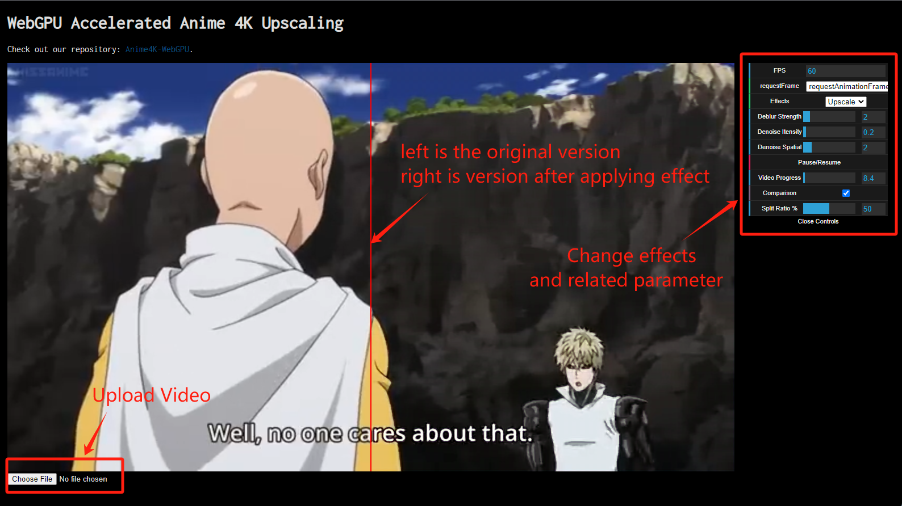

# WebGPU Accelerated Anime 4K

Authors (alphabetical order with equal contribution):
* Ruijun(Daniel) Zhong [LinkedIn](https://www.linkedin.com/in/daniel-z-73158b152/) | [Personal Website](https://www.danielzhongportfolio.com/)
* Tong Hu  [LinkedIn](https://www.linkedin.com/in/tong-hu-5819a122a/) 
* Yuanqi Wang [LinkedIn](https://www.linkedin.com/in/yuanqi-wang-414b26106/) | [GitHub](https://github.com/plasmas)

## Description
WebGPU Accelerated Anime 4K harnesses WebGPU and GPU compute shaders to rapidly enhance anime-style graphics. Leveraging the power of modern GPUs, it executes complex deblurring, CNN-based upscaling, and denoising algorithms in real-time. As a result, each video frame is processed instantaneously, improving clarity, sharpness, and eliminating noise as it streams. This ensures a superior viewing experience with high-quality visuals delivered without interruption, ideal for anime fans and professionals seeking top-notch and efficient image fidelity.

## UI

This is the ui of this demo. 

1. Click "Choose File" to upload video
2. Select effect from "Effects" drop down menu
3. Modify related parameters
4. If want to compare the video before and after applying effects, check the "Comparison" box

## Demo
Following are comparison of original video and modified video with different effects.

| **Deblur Demo** |
|:-:|
|  |

Presented here is a demonstration of the deblurring effect, showcasing a side-by-side comparison: the original 360P video is displayed on the left, while the deblurred version is featured on the right. The deblurring strength has been calibrated to a level of 3. As deblurring strength increasing, the effect of deblur is more distinct. This deblurring process enhances the video's clarity by sharpening the image's edges. However, it's important to note that this enhancement may also inadvertently amplify aliasing effects.

| **Denoise Demo** |
|:-:|
|  |

The denoise demostration also has the original 720P video on the left side with the denoised one on the right. The intensity sigma is set to 0.2 and the spatial sigma is set to 2. Increasing intensity sigma will make bilateral filter approximat Gaussian convolution, and increasing the spatial sigma will make the color smoother. 

| **Upscale Demo** |
|:-:|
|  |

In this demonstration, the video's resolution is enhanced through upscaling. Consequently, the comparison showcases bilinear sampling on the left side versus the upscaled version on the right side. The upscaled version offers better clarity and quality compared to the bilinearly sampled counterpart.

## Analyze

TODO

## Reference
This project references a variety of resources:

- **Anime4K**
  - GitHub Repository: [Anime4K](https://github.com/bloc97/Anime4K)
  - Unity Implementation: [Anime4K Unity](https://github.com/keijiro/UnityAnime4K)

- **StyleRF**
  - Research Paper: [StyleRF: Zero-shot 3D Style Transfer of Neural Radiance Fields](https://arxiv.org/pdf/2303.10598.pdf)

- **WebGPU**
  - Tutorial: [Your First WebGPU App](https://codelabs.developers.google.com/your-first-webgpu-app#0)
  - Base Code: [WebGPU Samples](https://github.com/webgpu/webgpu-samples)

- **Multimedia Demonstrations**
  - Demo Video (One Punch Man): [YouTube Video](https://www.youtube.com/watch?v=km2OPUctni4&list=LL&index=1&t=13s)
  - Demo Pictures: [Flickr Photos](https://www.flickr.com/photos/sunshinetoday168/50383058796)
  - Denoise Demo Video: [YouTube Denoise Demo](https://www.youtube.com/watch?v=CNenVlc1L2w)

- **Additional Resources**
  - Process Diagrams: [ProcessOn Diagrams](https://www.processon.com/diagrams)

All trademarks and registered trademarks are the property of their respective owners. This list is intended for informational and educational purposes only.
