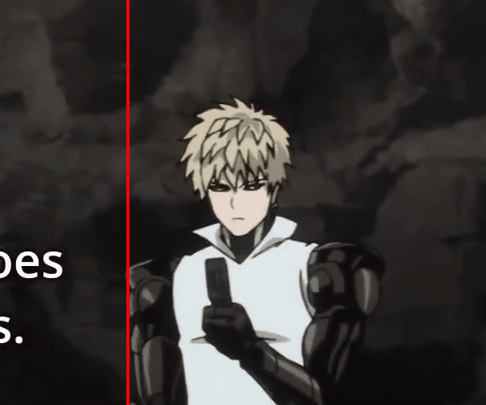

# WebGPU Accelerated Anime 4K

Authors (alphabetical order with equal contribution):
* Ruijun(Daniel) Zhong [LinkedIn](https://www.linkedin.com/in/daniel-z-73158b152/) | [Personal Website](https://www.danielzhongportfolio.com/)
* Tong Hu  [LinkedIn](https://www.linkedin.com/in/tong-hu-5819a122a/) 
* Yuanqi Wang [LinkedIn](https://www.linkedin.com/in/yuanqi-wang-414b26106/) | [GitHub](https://github.com/plasmas)

## Description
WebGPU Accelerated Anime 4K harnesses WebGPU and GPU compute shaders to rapidly enhance anime-style graphics. Leveraging the power of modern GPUs, it executes complex deblurring, CNN-based upscaling, and denoising algorithms in real-time. As a result, each video frame is processed instantaneously, improving clarity, sharpness, and eliminating noise as it streams. This ensures a superior viewing experience with high-quality visuals delivered without interruption, ideal for anime fans and professionals seeking top-notch and efficient image fidelity.

## Demo
| **Deblur Demo** |
|:-:|
|  |

| **Denoise Demo** |
|:-:|
|  |

| **Upscale Demo** |
|:-:|
|  |

## Getting Started
This is a [Next.js](https://nextjs.org/) project bootstrapped with [`create-next-app`](https://github.com/vercel/next.js/tree/canary/packages/create-next-app).

[Instructions for setting up and running the project]

## Learn More

[Additional resources and learning materials for Next.js]

## Deploy on Vercel

[Instructions and details for deploying on Vercel]

## Analyze

TODO

## Reference
This project references a variety of resources:

- **Anime4K**
  - GitHub Repository: [Anime4K](https://github.com/bloc97/Anime4K)
  - Unity Implementation: [Anime4K Unity](https://github.com/keijiro/UnityAnime4K)

- **StyleRF**
  - Research Paper: [StyleRF: Zero-shot 3D Style Transfer of Neural Radiance Fields](https://arxiv.org/pdf/2303.10598.pdf)

- **WebGPU**
  - Tutorial: [Your First WebGPU App](https://codelabs.developers.google.com/your-first-webgpu-app#0)
  - Base Code: [WebGPU Samples](https://github.com/webgpu/webgpu-samples)

- **Multimedia Demonstrations**
  - Demo Video (One Punch Man): [YouTube Video](https://www.youtube.com/watch?v=km2OPUctni4&list=LL&index=1&t=13s)
  - Demo Pictures: [Flickr Photos](https://www.flickr.com/photos/sunshinetoday168/50383058796)
  - Denoise Demo Video: [YouTube Denoise Demo](https://www.youtube.com/watch?v=CNenVlc1L2w)

- **Additional Resources**
  - Process Diagrams: [ProcessOn Diagrams](https://www.processon.com/diagrams)

All trademarks and registered trademarks are the property of their respective owners. This list is intended for informational and educational purposes only.
